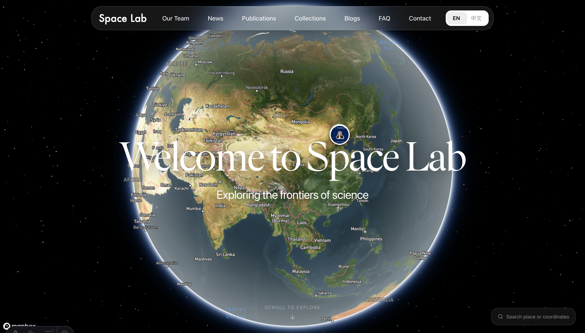

# Space Lab

<p align="center">
  
</p>

<p align="center">
  <a href="https://choucisan.github.io/collections/spacelab/"></a>
  <a href="https://www.xiaohongshu.com/explore/"></a>
  <a href="https://astro.build"></a>
  <a href="https://www.mapbox.com"></a>
  <a href="LICENSE"></a>
</p>

---

## Motivation

With the rapid advancement of AI, more and more research is being produced every day. Effectively communicating your work to peers, students, collaborators, and the public has never been more important.

**Space Lab** is a modern, polished website template designed for **research groups, labs, organizations, and individual researchers**. It provides a comprehensive showcase for your work — publications, projects, blog posts, news, and team profiles — all wrapped in an immersive space-themed design with an interactive 3D globe.

Whether you're a lab director wanting to attract prospective students, a researcher building your academic presence, or a team sharing open-source projects, Space Lab helps you present your work with clarity and style.

---

## Features

### Core Pages

| Feature | Description |
|---|---|
| **Home** | Interactive 3D globe with geotagged photo markers, search, and zoom controls |
| **Publications** | Showcase accepted papers, preprints, and journal articles with filtering |
| **News** | Lab updates, announcements, and achievements |
| **Collections** | Open-source projects, datasets, and resources |
| **Blogs** | Research notes, tutorials, and deep-dives |
| **Our Team** | Individual member profiles with bios, social links, publications, and honors |
| **FAQ** | Frequently asked questions about the lab |
| **Contact** | Contact information and links |

### Interactive 3D Globe

- **Geotagged photo markers** — place photos on locations worldwide
- **Multi-image carousel** — swipe through multiple images per location
- **Photo search** — search markers by keyword and fly the globe to results
- **Place search** — search any place name or GPS coordinates; globe flies to the location
- **Zoom presets** — 10km / 5km / 1km / 100m / 10m zoom levels
- **Mapbox-powered** — high-quality satellite imagery and terrain

### Design

- **Space theme** — animated starfield canvas with twinkling stars, nebulae, and shooting stars
- **Glass-morphism navigation** — frosted glass header with backdrop blur
- **Responsive layout** — optimized for desktop, tablet, and mobile
- **Dark mode** — comfortable reading on all pages

### Internationalization

Built-in bilingual support (English / Chinese) with `data-en` / `data-zh` attributes. Easily extendable to additional languages.

### Content Management

- **Markdown-based** — all content (publications, news, blogs, collections, markers) authored in Markdown with YAML frontmatter
- **Astro Content Collections** — type-safe content schemas with Zod validation
- **No database required** — fully static site, deploy anywhere

---

## Getting Started

### Prerequisites

- **Node.js** 18+
- **npm** 9+

### Quick Start

```bash
# Clone the repository
git clone https://github.com/choucisan/SpaceLab.git
cd SpaceLab

# Install dependencies
npm install

# Start the dev server
npm run dev
```

Open [http://localhost:4321](http://localhost:4321) in your browser.

### Mapbox API Token (for 3D Globe)

The 3D globe on the homepage uses Mapbox GL JS. To enable the interactive globe, you'll need a Mapbox access token:

1. Create a free account at [mapbox.com](https://www.mapbox.com)
2. Get your access token
3. Replace `MAPBOX_TOKEN` in `src/components/GlobeMap.astro`

> **Note:** If you're building a custom-style site and don't need the 3D globe, you can skip this step — simply replace the homepage hero with your own design.

### Build for Production

```bash
npm run build
```

The output is in `dist/` — deploy to any static hosting service (Netlify, Vercel, GitHub Pages, Cloudflare Pages, etc.).

---

## Project Structure

```text
SpaceLab/
├── public/
│   ├── assets/
│   │   ├── cards/          # Publication/project thumbnail images
│   │   ├── fonts/          # Custom fonts (Faire Octave)
│   │   ├── icons/          # SVG icons for social links
│   │   ├── logo/           # Space Lab logo
│   │   ├── space/          # Starfield cubemap textures
│   │   └── team/           # Team member photos
│   └── paper-sites/        # Individual paper/project pages
│       └── humanoid-vstar/ # Paper site template
├── src/
│   ├── components/         # Astro components (GlobeMap, StarsCanvas, Cards...)
│   ├── content/            # Markdown content collections
│   │   ├── blogs/          # Blog posts
│   │   ├── collections/    # Open projects/resources
│   │   ├── markers/        # Globe photo markers
│   │   ├── news/           # News articles
│   │   └── publications/   # Research publications
│   ├── data/               # Static data (team members)
│   ├── layouts/            # Base layout with header/footer
│   ├── pages/              # Route pages
│   └── styles/             # Global CSS
├── astro.config.mjs        # Astro configuration
├── package.json
└── tsconfig.json
```

---

## Customization

We encourage you to make Space Lab your own. Here's how:

### Basic Customization

1. **Replace assets** — swap `public/assets/logo/spacelab.svg` with your lab's logo, update team photos, and replace card thumbnails
2. **Edit content** — update Markdown files in `src/content/` with your lab's publications, news, and projects
3. **Update team** — edit `src/data/team.ts` with your members' information and social links
4. **Change color scheme** — modify the space theme variables in `src/styles/global.css`

### Advanced Customization

- **Add pages** — create new `.astro` files in `src/pages/` for custom routes
- **Custom globe style** — swap the Mapbox style URL in `src/components/GlobeMap.astro` for a different map aesthetic
- **Add languages** — extend the `data-XX` attribute system in `public/assets/js/i18n.js`
- **Custom domain** — configure your hosting provider's custom domain settings

### Content Schema

All content uses Zod schemas in `src/content.config.ts`. For example, a publication entry:

```yaml
---
title: "Your Paper Title"
authors: "Author One, Author Two"
venue: "Conference Name, Year"
date: 2025-06-15
img: "/assets/cards/your-image.png"
links:
  - label: "Paper"
    url: "https://arxiv.org/abs/..."
  - label: "Code"
    url: "https://github.com/..."
draft: false
---
```

### Paper Site Template

A stand-alone paper project page template is included at `public/paper-sites/humanoid-vstar/`. It's a self-contained HTML page designed to showcase a single research project with figures, bibliography, and links. Copy this folder and customize `index.html` for your own paper.

Special thanks to [THUSI-Lab/hstar](https://github.com/THUSI-Lab/hstar) for the original paper site template.

---

## Contact

For questions, suggestions, or contributions:[choucisan@gmail.com](mailto:choucisan@gmail.com)

